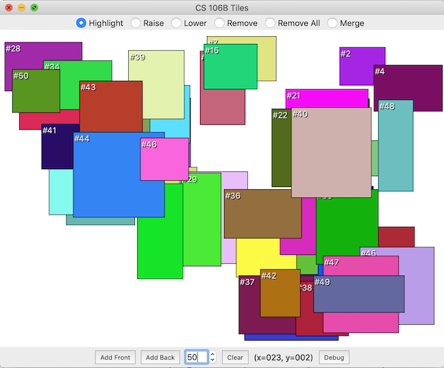

# Tiles
Tiles assignment for CS106B at Stanford Summer Session 2019.
This program simulates a graphic window manager of an operating sytem and allows users to move windows (or tiles) to the front, back, highlight a window, remove a window, merge multiple windows under the cursor. Tiles are stored as a doubly-linked list with its x and y coordinate on screen, width, height, and color.

# Installation
1. Download or clone this project.
2. Load this project into Qt Creator.
3. Build and run in Qt Creator.

# Credits
Assignment by Marty Stepp. Based on Priority Queue assignment by Jerry Cain. This project uses various modules from [the Stanford C++ Libraries](http://web.stanford.edu/~stepp/cppdoc/).